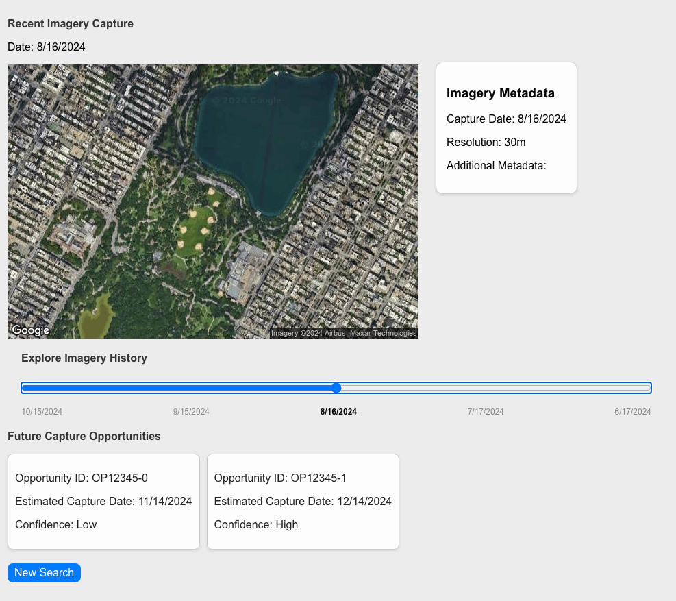

# Imagery Data Application

This project consists of a React frontend and a FastAPI backend for retrieving and displaying imagery data related to geographic locations.



## Getting Started

### Prerequisites

- [Node.js](https://nodejs.org/) and npm (for the React frontend)
- [Python 3.9](https://www.python.org/downloads/) (for the FastAPI backend)
- [Docker](https://www.docker.com/) (optional, for containerized setup)

### Setting Up and Running the Application Locally

#### Frontend (React)

1. Navigate to the root directory of the React application.
2. Install the dependencies:
   ```bash
   npm install
   ```
3. Start the development server:
   ```bash
   npm start
   ```
4. Open [http://localhost:3000](http://localhost:3000) to view it in your browser.

#### Backend (FastAPI)

1. Navigate to the `api` directory.
2. Create a virtual environment and activate it:
   ```bash
   python -m venv venv
   source venv/bin/activate  # On Windows use `venv\Scripts\activate`
   ```
3. Install the dependencies:
   ```bash
   pip install -r requirements.txt
   ```
4. Run the FastAPI server:
   ```bash
   uvicorn main:app --reload --port 4000
   ```
5. The API will be available at [http://localhost:4000](http://localhost:4000).

### Environment Variables

To run the application, you may need to set up some environment variables. These should be stored in a `.env` file in the root of your project. Here is an example of what your `.env` file might look like:

```
REACT_APP_API_URL=http://localhost:4000
REACT_APP_GOOGLE_MAPS_API_KEY=YOUR_GOOGLE_MAPS_API_KEY
REACT_APP_SENTINEL_API_KEY=YOUR_SENTINEL_API_KEY
```

### Application Structure

- **Frontend**: A React application bootstrapped with Create React App.
- **Backend**: A FastAPI application that provides endpoints for searching and retrieving imagery data.

### Dependencies

- **Frontend**: Managed via `package.json` using npm.
- **Backend**: Managed via `requirements.txt` using pip.

### Building and Deploying the Project

#### Docker Setup

1. Ensure Docker is installed and running.
2. Use the provided `Dockerfile` in the `api` directory to build the backend image:
   ```bash
   docker build -t imagery-backend ./api
   ```
3. Use the provided `Dockerfile` in the root directory to build the frontend image:
   ```bash
   docker build -t imagery-frontend .
   ```
4. Use `docker-compose` to orchestrate both services:
   ```bash
   docker-compose up --build
   ```
5. The frontend will be available at [http://localhost:3000](http://localhost:3000) and the backend at [http://localhost:4000](http://localhost:4000).

### Learn More

- [Create React App documentation](https://facebook.github.io/create-react-app/docs/getting-started)
- [FastAPI documentation](https://fastapi.tiangolo.com/)
